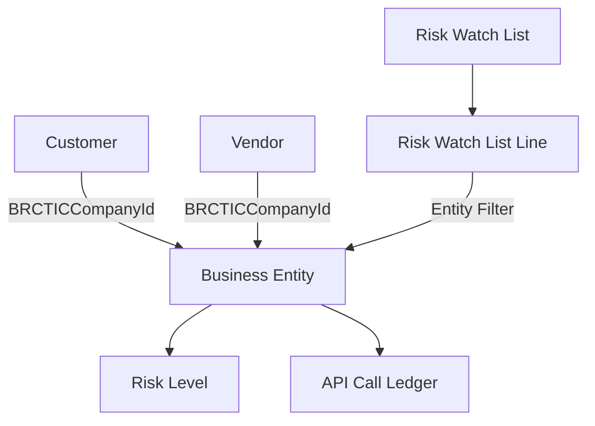

## Integration Overview

BRC Risk Management provides seamless integration with Business Central and external risk data providers through multiple integration points including API connections, webhook notifications, and standard BC extension patterns.

## Business Central Integration

### Core Module Extensions

**Customer Module Integration:**
- **Table Extension**: Adds `BRCTICCompanyId` field to Customer table
- **Page Extensions**: Risk FactBox on Customer Card and List
- **Field Integration**: Color-coded risk indicators using StyleExpr
- **Actions**: "Fetch Risk Data" and "Add to Watchlist" on Customer pages

**Vendor Module Integration:**
- **Table Extension**: Adds `BRCTICCompanyId` field to Vendor table  
- **Page Extensions**: Risk FactBox on Vendor Card and List
- **Field Integration**: Color-coded risk indicators using StyleExpr
- **Actions**: "Fetch Risk Data" and "Add to Watchlist" on Vendor pages

### Navigation Integration

**Role Center Integration:**
- **Risk Manager Role Center**: Dedicated workspace for risk management
- **Risk Assessment Cues**: Live metrics and key performance indicators
- **Quick Actions**: Direct access to entities, watchlists, and setup

**Menu Integration:**
- **Departments → Financial Management → Risk Management**: Standard navigation pattern
- **Search Integration**: "Risk" keyword brings up all related functionality
- **Action Integration**: Risk-related actions available from relevant contexts

### Database Integration

**Object ID Range:** 70000-70099
- **Tables**: Business Entity (70000), Risk Setup (70004), Watchlists (70005)
- **Pages**: Setup (70020), Entity List/Card (70030/70031), Role Center (70050)
- **Extensions**: Customer (70000), Vendor (70001) with namespace-based organization

**Data Relationships:**


## API Integration

### TIC API Integration (Primary Provider)

**Authentication:**
- **Method**: API Key authentication in request headers
- **Storage**: Encrypted storage in Business Central IsolatedStorage
- **Security**: Secure credential management with automatic masking in logs

**Supported Operations:**
- **Company Search**: Search by company name, VAT number, registration number
- **Risk Data Fetch**: Retrieve credit scores, debt balance, payment marks
- **Bulk Operations**: Multiple company queries in single request
- **Watchlist Registration**: Register criteria-based monitoring with TIC

**API Endpoints:**
```http
GET /companies/search?name={companyName}
GET /companies/{ticCompanyId}/risk-data
POST /companies/bulk-fetch
POST /watchlists
GET /watchlists/{watchlistId}/matches
```

### Request/Response Format

**Company Search Request:**
```json
{
  "searchCriteria": {
    "companyName": "Example Company Ltd",
    "vatNumber": "GB123456789",
    "registrationNumber": "12345678",
    "country": "GB"
  },
  "includeRiskData": true
}
```

**Risk Data Response:**
```json
{
  "ticCompanyId": "123456789",
  "companyName": "Example Company Ltd",
  "riskData": {
    "creditScore": 75,
    "riskLevel": "MEDIUM",
    "debtBalance": 25000.00,
    "paymentMarks": 2,
    "lastUpdated": "2025-12-01T10:30:00Z"
  },
  "dataVersion": 42
}
```

### Alternative Provider Integration

**Compatibility Requirements:**
- **Protocol**: REST API with JSON responses
- **Authentication**: API key or token-based authentication
- **Data Fields**: Credit score, debt information, payment history
- **Search Capability**: Company lookup by name or registration details

**Implementation Steps:**
1. Implement `IRiskDataProvider` interface
2. Configure API endpoints in Risk Setup
3. Map response fields to Business Central data structure
4. Test connection and data retrieval
5. Configure rate limiting and error handling

## Webhook Integration

### Inbound Webhooks (From Risk Providers)

**Real-Time Notifications:**
- **Risk Level Changes**: Immediate notifications when risk status changes
- **Watchlist Matches**: Alerts when entities meet watchlist criteria
- **Data Updates**: Notifications of new risk data availability

**Webhook Configuration:**
```json
{
  "webhookUrl": "https://yourtenant.bc.dynamics.com/webhook/risk/notification",
  "authToken": "secure-webhook-token",
  "events": ["riskLevelChanged", "watchlistMatch", "dataUpdate"],
  "entityFilter": {
    "watchlistIds": [1, 2, 3],
    "riskLevels": ["HIGH", "CRITICAL"]
  }
}
```

**Webhook Processing:**
1. **Authentication**: Verify webhook source and token
2. **Payload Validation**: Ensure data structure and required fields
3. **Entity Matching**: Link webhook data to Business Central entities
4. **Risk Update**: Update entity risk data and trigger workflows
5. **Notification**: Generate internal notifications per user preferences

### Outbound Webhooks (To External Systems)

**Notification Delivery:**
- **CRM Systems**: Update customer risk data in sales/marketing platforms
- **ERP Integration**: Sync risk information to other financial systems  
- **Monitoring Tools**: Send alerts to business intelligence platforms
- **Communication**: Trigger email or SMS notifications through external services

**Webhook Payload Example:**
```json
{
  "eventType": "RiskLevelChanged",
  "timestamp": "2025-12-01T10:30:00Z",
  "entity": {
    "ticCompanyId": "123456789",
    "companyName": "Example Company Ltd",
    "customerNo": "C001",
    "vendorNo": "V001"
  },
  "riskChange": {
    "oldLevel": "MEDIUM",
    "newLevel": "HIGH",
    "creditScore": 45,
    "trigger": "creditScoreDecrease"
  }
}
```

## Job Queue Integration

### Background Processing

**Scheduled Risk Updates:**
```al
JobQueueEntry.INIT;
JobQueueEntry."Object Type to Run" := JobQueueEntry."Object Type to Run"::Codeunit;
JobQueueEntry."Object ID to Run" := CODEUNIT::"Bulk Risk Data Fetcher";
JobQueueEntry."Recurring Job" := true;
JobQueueEntry."Run on Mondays" := true;
JobQueueEntry."Starting Time" := 080000T; // 8:00 AM
```

**Processing Types:**
- **Individual Updates**: Single entity risk data refresh
- **Bulk Updates**: Multiple entities processed in batch
- **Watchlist Evaluation**: Check entities against watchlist criteria
- **Cleanup Tasks**: Archive old data and logs

**Error Handling:**
- **Retry Logic**: Automatic retry for transient failures
- **Dead Letter Queue**: Store failed requests for manual review
- **Alert Generation**: Notify administrators of persistent failures
- **Logging**: Comprehensive audit trail for troubleshooting

## Integration Events

### Publisher Events

**Available Events:**
```al
[IntegrationEvent(false, false)]
local procedure OnBeforeRiskDataFetch(var BusinessEntity: Record "Business Entity"; var IsHandled: Boolean)

[IntegrationEvent(false, false)]
local procedure OnAfterRiskDataUpdated(var BusinessEntity: Record "Business Entity"; OldRiskLevel: Code[10])

[IntegrationEvent(false, false)]
local procedure OnRiskLevelChanged(var BusinessEntity: Record "Business Entity"; OldRiskLevel: Code[10]; NewRiskLevel: Code[10])

[IntegrationEvent(false, false)]
local procedure OnWatchlistCriteriaMatched(var RiskWatchList: Record "Risk Watch List"; var BusinessEntity: Record "Business Entity")

[IntegrationEvent(false, false)]
local procedure OnApiCallCompleted(var APICallLedger: Record "API Call Ledger"; Success: Boolean)
```

### Custom Integration Examples

**Risk Level Validation:**
```al
[EventSubscriber(ObjectType::Table, Database::"Business Entity", 'OnRiskLevelChanged', '', false, false)]
local procedure OnRiskLevelChangedCustomValidation(var BusinessEntity: Record "Business Entity"; OldRiskLevel: Code[10]; NewRiskLevel: Code[10])
begin
    // Custom business logic for risk level changes
    if NewRiskLevel = 'CRITICAL' then
        SendUrgentNotification(BusinessEntity);
end;
```

**Custom Notification Logic:**
```al
[EventSubscriber(ObjectType::Table, Database::"Risk Watch List", 'OnWatchlistCriteriaMatched', '', false, false)]
local procedure OnWatchlistMatchCustomActions(var RiskWatchList: Record "Risk Watch List"; var BusinessEntity: Record "Business Entity")
begin
    // Integrate with external CRM system
    UpdateCRMRiskStatus(BusinessEntity);
    
    // Log to custom audit system
    CreateCustomAuditEntry(RiskWatchList, BusinessEntity);
end;
```

## Third-Party System Integration

### CRM Integration

**Salesforce Integration:**
- **Risk Data Sync**: Push Business Central risk data to Salesforce accounts
- **Opportunity Scoring**: Include risk factors in sales opportunity evaluation
- **Lead Qualification**: Auto-qualify leads based on risk assessment
- **Account Management**: Risk-based account categorization

**Microsoft Dynamics 365 Sales:**
- **Entity Linking**: Connect BC Business Entities to Dynamics Sales accounts
- **Risk Insights**: Display risk information in Dynamics Sales interface
- **Sales Process**: Incorporate risk data into sales workflow
- **Reporting**: Combined sales and risk analytics

### Financial System Integration

**Banking Platforms:**
- **Credit Limit Sync**: Update bank credit facilities based on risk assessment
- **Payment Terms**: Adjust payment conditions based on customer risk
- **Collection Management**: Prioritize collections using risk data
- **Cash Flow Planning**: Incorporate risk factors in cash flow forecasts

**Accounting Systems:**
- **Provision Calculation**: Calculate bad debt provisions using risk data
- **Credit Loss Modeling**: Feed risk scores into credit loss calculations
- **Financial Reporting**: Include risk metrics in financial statements
- **Audit Trail**: Provide risk assessment documentation for auditors

### Business Intelligence Integration

**Power BI Integration:**
- **Risk Dashboards**: Create comprehensive risk management dashboards
- **Trend Analysis**: Track risk level changes over time
- **Portfolio Analysis**: Analyze risk distribution across customer/vendor portfolio
- **Predictive Analytics**: Use risk data for forecasting and planning

**Data Warehouse Integration:**
- **Data Export**: Scheduled export of risk data to data warehouse
- **ETL Processing**: Transform risk data for analytics consumption
- **Historical Tracking**: Long-term risk trend storage and analysis
- **Cross-System Analytics**: Combine risk data with other business metrics

## Security and Compliance

### Data Protection

**Encryption:**
- **In Transit**: TLS 1.2+ for all API communications
- **At Rest**: Business Central standard encryption for stored data
- **Credentials**: Encrypted storage of API keys and authentication tokens

**Access Control:**
- **Permission Sets**: Role-based access to integration features
- **API Security**: Secure authentication for all external connections
- **Audit Logging**: Comprehensive tracking of all integration activities

### Compliance Standards

**GDPR Compliance:**
- **Data Minimization**: Only necessary risk data is stored
- **Right to Erasure**: Support for data deletion requests
- **Data Portability**: Export capabilities for data transfer
- **Consent Management**: Clear consent for third-party data usage

**Industry Standards:**
- **SOC 2**: Service organization control compliance
- **ISO 27001**: Information security management standards
- **PCI DSS**: Payment card industry data security (where applicable)

## Integration Best Practices

### Performance Optimization

**API Efficiency:**
- **Batch Processing**: Group API calls to minimize request overhead
- **Caching**: Cache frequently accessed data to reduce API calls
- **Rate Limiting**: Respect provider API limits and implement queuing
- **Async Processing**: Use background jobs for non-critical operations

**Database Optimization:**
- **Indexing**: Proper indexes on frequently queried fields
- **Archiving**: Regular archival of old audit trail data
- **Connection Management**: Efficient database connection usage
- **Query Optimization**: Optimized queries for large datasets

### Reliability and Monitoring

**Error Handling:**
- **Graceful Degradation**: System continues functioning during API outages
- **Retry Logic**: Smart retry mechanisms for transient failures  
- **Circuit Breaker**: Prevent cascade failures during system issues
- **Monitoring**: Comprehensive monitoring of integration health

**Logging and Alerting:**
- **Comprehensive Logging**: Detailed logs for troubleshooting
- **Performance Metrics**: Track response times and success rates
- **Business Alerts**: Notify stakeholders of critical issues
- **System Alerts**: Technical alerts for IT support teams

---

*For implementation details and technical specifications, see the [Reference Documentation](../reference/) section.*